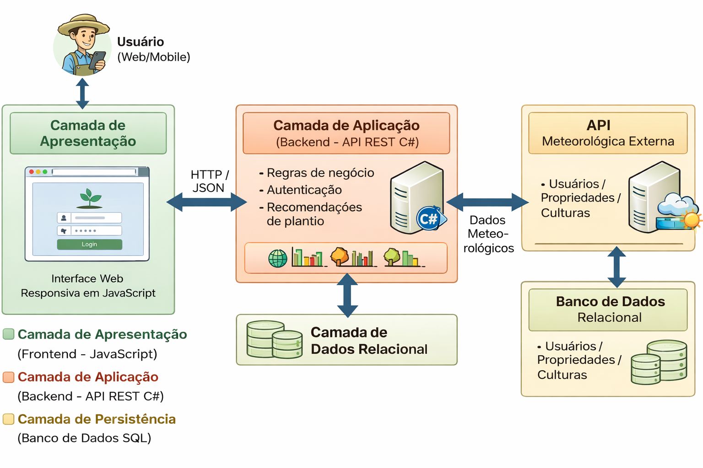
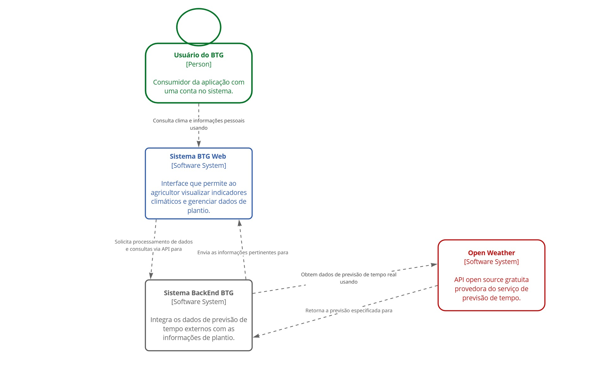
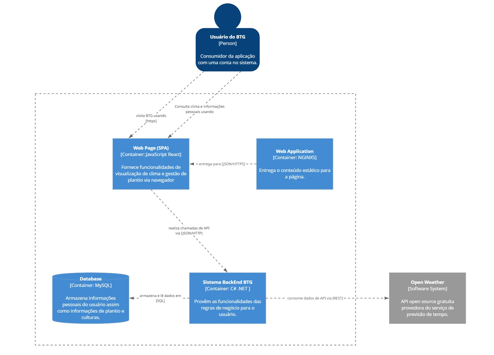
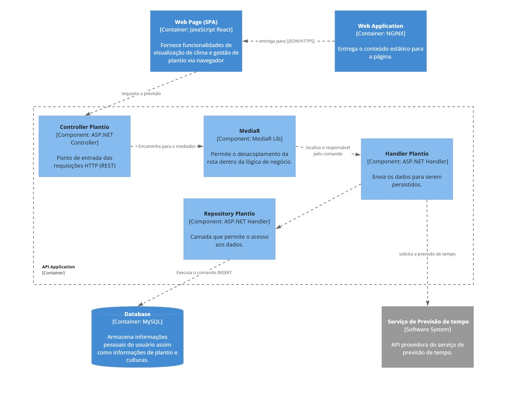
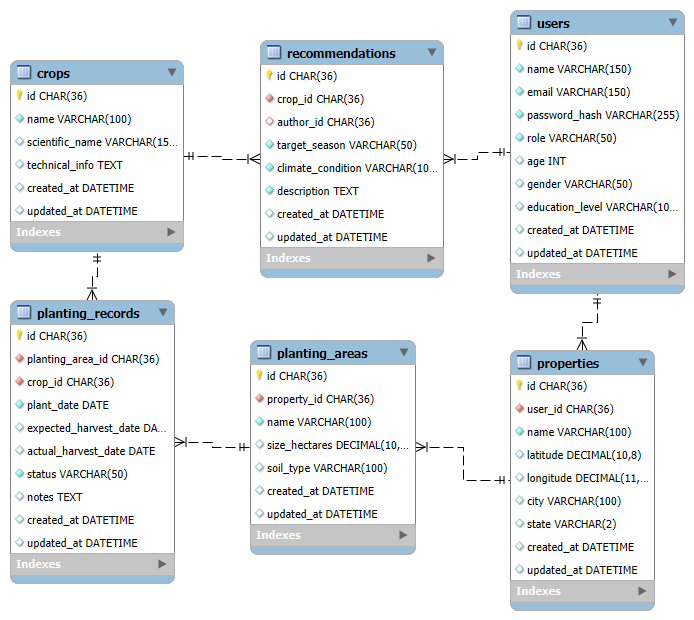

# 3 Modelagem e diagramas arquiteturais: (Modelo C4)
A solução do sistema BTG (Best Time to Grow) é baseada em uma arquitetura cliente-servidor em três camadas. A camada de apresentação (frontend), desenvolvida em JavaScript, fornece uma interface web responsiva acessada por navegadores, permitindo que o usuário interaja com o sistema. Essa camada se comunica via HTTP/JSON com a camada de aplicação (backend), implementada em C# com API REST, responsável pela lógica de negócio, autenticação e geração de recomendações de plantio com base em clima e estação. Por fim, a camada de persistência utiliza um banco de dados relacional (PostgreSQL/MySQL) para armazenar usuários, propriedades e dados agrícolas, além da integração com uma API meteorológica externa para obtenção de informações climáticas.

    
  Figura 1: Visão Geral da Solução (camadas)

## 3.1 Nível 1: Diagrama de Contexto

O diagrama de contexto apresenta uma visão macro do sistema **BTG Web**, destacando sua interação com os principais atores e sistemas externos. No centro está o sistema, utilizado pelo **Usuário do BTG**, que representa o consumidor da aplicação com acesso às funcionalidades por meio de uma interface web.

O usuário interage com o sistema para consultar informações climáticas e gerenciar dados relacionados ao plantio. Além disso, o sistema se integra a um serviço externo, o **OpenMeteo**, responsável por fornecer dados de previsão do tempo em tempo real (figura 2).

   
  Figura 2: Diagrama de Contexto  (fonte: própria)

## 3.2 Nível 2: Diagrama de Contêiner

O diagrama de contêiner apresenta a arquitetura de alto nível do sistema, evidenciando como as responsabilidades estão distribuídas entre diferentes partes da aplicação e quais tecnologias são utilizadas.

O sistema é composto por quatro principais contêineres:

- **Web Page (SPA)**: Desenvolvida em React, é responsável pela interface com o usuário, permitindo a visualização de dados climáticos e o gerenciamento de informações de plantio.
- **Web Application (NGINX)**: Atua como servidor web, responsável por entregar o conteúdo estático da aplicação (HTML, CSS, JavaScript).
- **Sistema BackEnd BTG**: Desenvolvido em .NET, concentra a lógica de negócio, processa as requisições do usuário e realiza integrações externas.
- **Database (MySQL)**: Responsável pelo armazenamento persistente dos dados dos usuários e das informações de plantio.

A comunicação entre os contêineres ocorre principalmente via HTTP/HTTPS e troca de dados em formato JSON. O frontend consome a API do backend, que por sua vez acessa o banco de dados e integra-se com a API externa do OpenMeteo para obtenção de dados climáticos (figura 3).

   
  Figura 3 – Diagrama de Contêiner  (fonte: própria)

## 3.3 Nível 3: Diagrama de Componentes
O diagrama de componentes detalha a estrutura interna do contêiner de backend, evidenciando os principais componentes, suas responsabilidades e os padrões arquiteturais adotados.

A arquitetura segue principalmente os padrões **MVC (Model-View-Controller)** e **Mediator**, promovendo desacoplamento e organização da lógica de negócio.

### Componentes:

- **Controller Plantio**  
  Atua como ponto de entrada das requisições HTTP (REST). Recebe as solicitações do frontend e as encaminha para a camada de aplicação.

- **MediatR**  
  Responsável por intermediar a comunicação entre os componentes, desacoplando o controller da lógica de negócio e direcionando as requisições para os handlers apropriados.

- **Handler Plantio**  
  Contém a lógica de negócio específica das operações relacionadas ao plantio, processando os dados recebidos e coordenando a persistência.

- **Repository Plantio**  
  Responsável pelo acesso aos dados, executando operações no banco de dados, como inserções e consultas.

O backend também se comunica com um serviço externo de previsão do tempo (OpenMeteo), integrando esses dados às funcionalidades do sistema (figura 4).

   
  Figura 4 – Diagrama de Componentes  (fonte: própria)

## 3.4 Nível 4: Código

Aqui vocês devem apresentar cada componente para mostrar como ele é implementado como código; serve também para explicar a arquitetura. Pode-se utilizar um diagrama de classe UML, um diagrama de Entidade/Relacionamentos (figura 5), tabelas do banco de dados, estrutura de um JSON, estrutura de classes de código, etc. 

Este modelo pode ser essencial caso a arquitetura utilize uma solução de banco de dados – SQL, distribuído ou NoSQL.

    
  Figura 5 – Diagrama de Entidade Relacionamento (ER) - exemplo. (Fonte Prof. Pedro Alves)

Acrescentem uma breve descrição sobre o diagrama apresentado na Figura 5, descrevendo as entidades que compõem o sistema.
